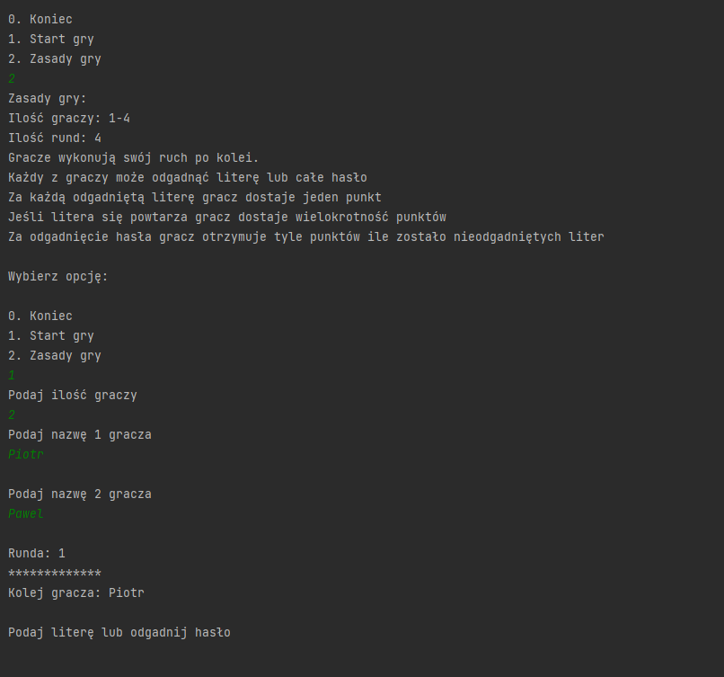
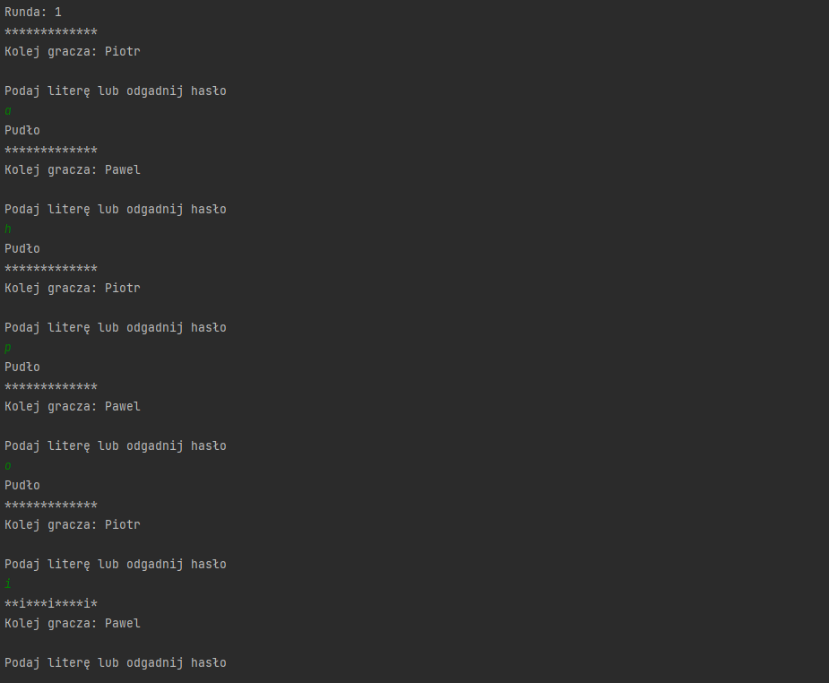
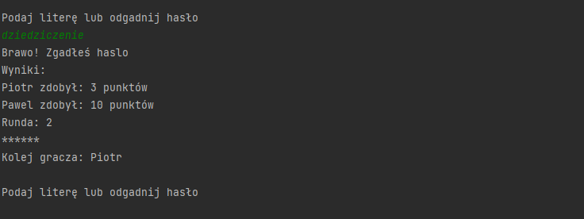

# Project name
wheel.of.fortune
# General information
A simple console game for up to 4 players.
Players try to guess a randomly selected word from the file. 
You can guess a letter or the entire password. The game counts points. One point is awarded for each letter. If a letter appears more than once, an appropriate number of points is awarded.
The game lasts 4 rounds. Once a word is drawn, it will not be repeated in subsequent rounds.
# Technologies Used
Java (without frameworks)
GSON
# Screenshots

